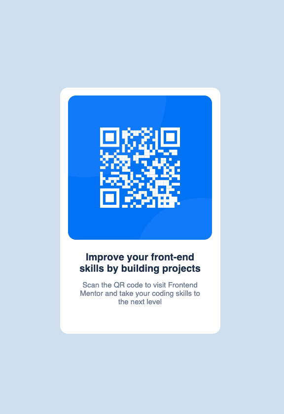

# Frontend Mentor - QR code component solution

This is a solution to the [QR code component challenge on Frontend Mentor](https://www.frontendmentor.io/challenges/qr-code-component-iux_sIO_H). Frontend Mentor challenges help you improve your coding skills by building realistic projects. 

## Table of contents

- [Frontend Mentor - QR code component solution](#frontend-mentor---qr-code-component-solution)
  - [Table of contents](#table-of-contents)
  - [Overview](#overview)
    - [Screenshot](#screenshot)
    - [Links](#links)
  - [My process](#my-process)
    - [Built with](#built-with)
    - [What I learned](#what-i-learned)
  - [Author](#author)

## Overview

### Screenshot

### Links

- Solution URL: [Frontend Mentor](https://www.frontendmentor.io/solutions/qr-code-with-react-and-css-xAKcdZnVYg)
- Live Site URL: [Netlify](https://deft-starship-8a98d5.netlify.app)

## My process

### Built with

- Semantic HTML5 markup
- CSS Flexbox
- Mobile-first workflow
- [React](https://reactjs.org/) - JS library

### What I learned

This project was a quick was a quick way to review CSS over the long weekend.

## Author

- LinkedIn - [Larry Reaux](https://www.linkedin.com/in/ljreaux/)
- Frontend Mentor - [@ljreaux](https://www.frontendmentor.io/profile/ljreaux)

